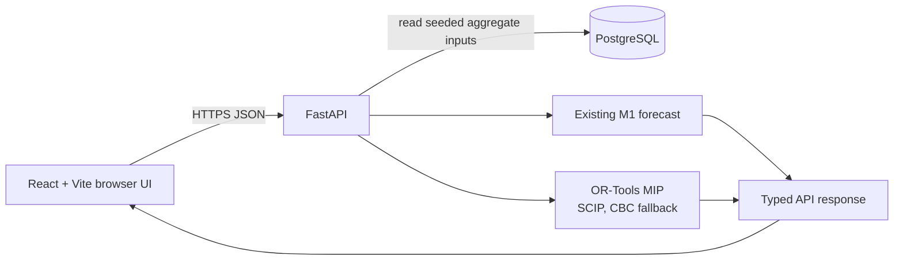

# PeopleOps Decision Lab — Workforce Planning & Optimization

PeopleOps Decision Lab is a synthetic, aggregate workforce-planning demo. It helps a decision-maker see where a six-month staffing plan is at risk, test transient assumptions, and optimize constrained hiring starts without collecting employee, candidate, or payroll records.

> **Live demo:** [peopleops-decision-lab.vercel.app](https://peopleops-decision-lab.vercel.app)
>
> **Source:** [github.com/akomage1-lab/peopleops-decision-lab](https://github.com/akomage1-lab/peopleops-decision-lab)

## The decision it supports

The app answers a deliberately narrow question: given current aggregate FTE, planned staffing targets, expected attrition, hiring lead times, a planning-period incremental workforce budget, and monthly recruiting capacity, which hiring starts best reduce in-horizon understaffing?

The **Overview** shows observed aggregate workforce context and a persisted six-month forecast. The **Decision Lab** lets a user change a scenario in the browser, compare baseline and scenario risk, and request an optimized plan. Scenario edits are transient: nothing is written back from the UI.

## Architecture



For public deployment, the same components map cleanly to Vercel (static Vite frontend), Railway (always-on FastAPI), and Neon (hosted PostgreSQL). The exact release procedure is in [the deployment runbook](docs/M9_DEPLOYMENT.md).

## How the planning model works

The model plans at **Department × Role × Month**. Annual expected attrition is converted to an equivalent monthly rate. Each month applies expected attrition to prior FTE, then adds in-flight arrivals and optimized hires whose whole-month lead time has elapsed. Shortage is `max(target - expected_fte, 0)`, so expected FTE can be fractional.

The optimizer uses a lexicographic two-pass mixed-integer solve:

1. Minimize total understaffed FTE-months over the fixed six-month horizon.
2. Minimize planning-period incremental workforce spend while preserving that shortage optimum within `1e-7`, a numerical feasibility tolerance for floating-point solver values rather than an objective trade-off.

The planning-period incremental workforce budget covers **only optimized-hire loaded workforce/payroll cost incurred after arrival inside the horizon**. Existing workforce and in-flight costs are excluded. Starts that would arrive after Month 6 are not representable; a Month-6 arrival contributes one month of cost and coverage only when that is optimal.

## Data, model boundaries, and responsible use

All data is deterministic, hand-authored, synthetic, and aggregate. The project is a portfolio proof of concept, not an HR system or an automated employment decision-maker. It does not contain employee or candidate records, demographic data, compensation records, authentication, payroll workflows, or production integrations.

Outputs are scenario analysis, not recommendations about individuals. They should be reviewed with human judgment and organizational context before any staffing action. The model does not represent uncertainty, productivity ramps, interview capacity, source channels, geographic constraints, role-specific recruiting caps, or legal and fairness review requirements.

## Stack and quality checks

- **Frontend:** React, TypeScript, Vite, Vitest, Playwright
- **API:** FastAPI, Pydantic, SQLAlchemy
- **Data:** PostgreSQL, Alembic, deterministic seed
- **Optimization:** existing M1 OR-Tools MIP model using SCIP with an explicit CBC fallback
- **Quality:** Python integration/regression tests; frontend unit, type, build, and live browser tests; GitHub Actions validation

The browser path is tested against the real FastAPI service, PostgreSQL seed, forecast, and optimizer—without mocking the API. The test suite also guards budget, recruiting-capacity, end-of-horizon, and lexicographic-optimality invariants.

## Run locally

Requirements: Python 3.9+, Node 20+, and PostgreSQL 16. Copy the safe local defaults; never commit a real `.env` file.

```bash
cp .env.example .env
python3 -m venv .venv
.venv/bin/python -m pip install --upgrade pip
.venv/bin/python -m pip install -e '.[dev]'
.venv/bin/python -m alembic upgrade head
.venv/bin/python -m api.seed
```

Create local development and test databases if needed:

```bash
createdb peopleops_decision_lab
createdb peopleops_decision_lab_test
```

Run the API and UI in separate terminals:

```bash
.venv/bin/python -m uvicorn api.app.main:app --host 127.0.0.1 --port 8000
```

```bash
cd web
npm ci
npm run dev
```

Open `http://127.0.0.1:5173`. With `VITE_API_BASE_URL` empty, Vite's development-only proxy routes relative `/api` calls to local FastAPI. For an external API, copy `web/.env.example` to `web/.env.local` and set `VITE_API_BASE_URL` to its HTTPS origin.

## Validate locally

```bash
M2_TEST_DATABASE_URL=postgresql+psycopg:///peopleops_decision_lab_test .venv/bin/python -m pytest -q
cd web && npm ci && npm test && npm run typecheck && npm run build
```

With PostgreSQL, FastAPI, and Vite running, execute the live browser checks:

```bash
cd web
npx playwright install chromium
npm run e2e
```

## Deployment preparation and project history

- [M9 deployment runbook](docs/M9_DEPLOYMENT.md): exact GitHub, Neon, Railway, Vercel, CORS, and production-acceptance steps for M9.2.
- [Portfolio copy](docs/PORTFOLIO_COPY.md): concise, honest project and résumé descriptions.
- [M8 reliability guide](docs/M8_RELIABILITY.md): CI, test layers, error handling, accessibility, and public-repository safeguards.
- [Synthetic demo-data story](docs/DEMO_DATA_STORY.md), [M5 optimizer contract](docs/M5_PRODUCTION_OPTIMIZER.md), and [M6 Decision Lab contract](docs/M6_DECISION_LAB.md): supporting product and model detail.

M0 through M8 delivered the frozen planning contract, M1 engine, live seeded browser path, aggregate data/forecast/optimization services, Decision Lab, executive analytics, and reliability hardening. M9.1 prepares those existing capabilities for portfolio release; it does not add a new planning feature or alter the model.
