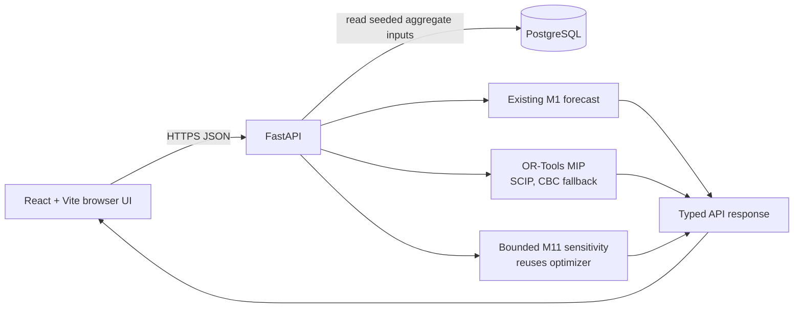

# PeopleOps Decision Lab — Workforce Planning & Optimization

PeopleOps Decision Lab is a public full-stack workforce-planning portfolio project that forecasts staffing shortages, lets a user test assumptions, solves for constrained hiring starts, explains why the result is optimal under the model, and shows how sensitive that solution is to budget and recruiting capacity.

> **Live demo:** [peopleops-decision-lab.vercel.app](https://peopleops-decision-lab.vercel.app)
>
> **Source:** [github.com/akomage1-lab/peopleops-decision-lab](https://github.com/akomage1-lab/peopleops-decision-lab)
>
> **Data:** every company and workforce value is deterministic, synthetic, and aggregate.

## Why this project is different

This is not CRUD or a generic HR dashboard. It is a deliberately bounded workforce decision system:

**Forecast → Scenario → Optimize → Audit → Sensitivity**

- **Forecast:** identifies company-wide staffing shortages across a fixed six-month horizon.
- **Scenario:** changes role-level attrition or staffing-target assumptions without altering the persisted baseline.
- **Optimize:** chooses integer hiring starts under company-wide budget, monthly recruiting capacity, and role lead-time constraints.
- **Audit:** makes the objective, constraints, improvement, spend, solver optimality, recommendation timing, and model limits visible.
- **Sensitivity:** reruns the same optimizer under bounded alternative resource constraints.

The app answers a narrow question: given aggregate FTE, planned staffing targets, expected attrition, hiring lead times, a planning-period incremental workforce budget, and company-wide monthly recruiting capacity, which hiring starts best reduce in-horizon understaffing?

## Try it in about 90 seconds

1. Open the [live demo](https://peopleops-decision-lab.vercel.app) and scan the Overview.
2. Open **Decision Lab**.
3. Change one role assumption.
4. Select **Run Scenario**, then **Optimize Scenario**.
5. Inspect the Decision Audit and recommendation table.
6. Select **Analyze constraint sensitivity**.

## Architecture



React presents the workflow and typed results; FastAPI handles transient scenario and sensitivity requests; PostgreSQL holds only deterministic aggregate demo inputs; and OR-Tools solves the constrained plan. Vercel serves the frontend, Railway runs the API, and Neon hosts PostgreSQL. The exact release procedure is in [the deployment runbook](docs/M9_DEPLOYMENT.md).

## How the planning model works

The model plans at **Department × Role × Month** over a fixed **Jan–Jun 2026** horizon. FTE is staffing capacity; an understaffed FTE-month is one FTE below target for one month. Annual expected attrition is converted to an equivalent monthly rate. Each month applies expected attrition to prior FTE, then adds in-flight arrivals and optimized hires whose whole-month lead time has elapsed. Shortage is `max(target - expected_fte, 0)`, so expected FTE can be fractional.

Hiring starts are integer decisions. The optimizer respects role lead times, a company-wide planning-period incremental workforce budget, and company-wide monthly recruiting capacity. Its lexicographic two-pass mixed-integer solve:

1. Minimizes total understaffed FTE-months over the six-month horizon.
2. Among plans tied on that result, minimizes in-horizon incremental workforce spend while preserving the shortage optimum within `1e-7`, a floating-point numerical feasibility tolerance rather than an objective trade-off.

A selected hire consumes its role’s modeled monthly loaded workforce cost from arrival through the end of the planning horizon. Existing workforce and in-flight costs are excluded. Starts that would arrive after Month 6 are not representable; a Month-6 arrival has one month of cost and coverage only when optimal.

**Optimal** means no feasible plan under the stated model and constraints has lower total understaffing. It does not mean the best strategic business decision, highest revenue impact, most important roles, best candidates, or a universal best workforce plan.

## Advanced differentiator: constraint sensitivity

M11 reuses the exact production optimizer to run a small, transparent local sensitivity analysis. It tests budget at **50%, 75%, 100%, 125%, and 150%** of the submitted value, and monthly recruiting capacity at **-1, submitted, and +1 start per month** (with valid vectors deduplicated).

Every point must be proven optimal through the existing fail-closed path. The analysis also checks that increasing tested budget or capacity does not worsen optimized understaffing, within the documented tolerance. This is local sensitivity analysis under the fixed scenario—not causal analysis, a smooth curve, or evidence that either constraint is “the bottleneck.”

## Data, model boundaries, and responsible use

All data is hand-authored, synthetic, deterministic, and aggregate. This project is a portfolio proof of concept, not an HR system or automated employment decision-maker. It contains no employee or candidate records, demographic data, compensation records, authentication, payroll workflows, ATS integrations, or production-company inputs.

Outputs are staffing-capacity scenario analysis, not recommendations about individuals. They should be reviewed with human judgment and organizational context before any staffing action. The model does not represent uncertainty, productivity ramps, interview capacity, source channels, geographic constraints, role criticality, revenue impact, candidate quality, or legal and fairness review requirements.

## Stack and quality checks

- **Frontend:** React, TypeScript, Vite, Vitest, Playwright
- **API:** FastAPI, Pydantic, SQLAlchemy
- **Data:** PostgreSQL, Alembic, deterministic seed
- **Optimization:** OR-Tools MIP using SCIP with explicit CBC fallback
- **Quality:** Python integration/regression tests; frontend unit, type, build, and live browser tests; GitHub Actions validation

The browser path is tested against the real FastAPI service, PostgreSQL seed, forecast, optimizer, and sensitivity endpoint—without mocking the API. Tests guard budget, recruiting-capacity, end-of-horizon, lexicographic-optimality, and sensitivity monotonicity invariants.

## Run locally

Requirements: Python 3.9+, Node 20+, and PostgreSQL 16. Copy the safe local defaults; never commit a real `.env` file.

```bash
cp .env.example .env
python3 -m venv .venv
.venv/bin/python -m pip install --upgrade pip
.venv/bin/python -m pip install -e '.[dev]'
.venv/bin/python -m alembic upgrade head
.venv/bin/python -m api.seed
```

Create local development and test databases if needed:

```bash
createdb peopleops_decision_lab
createdb peopleops_decision_lab_test
```

Run the API and UI in separate terminals:

```bash
.venv/bin/python -m uvicorn api.app.main:app --host 127.0.0.1 --port 8000
```

```bash
cd web
npm ci
npm run dev
```

Open `http://127.0.0.1:5173`. With `VITE_API_BASE_URL` empty, Vite's development-only proxy routes relative `/api` calls to local FastAPI. For an external API, copy `web/.env.example` to `web/.env.local` and set `VITE_API_BASE_URL` to its HTTPS origin.

## Validate locally

```bash
M2_TEST_DATABASE_URL=postgresql+psycopg:///peopleops_decision_lab_test .venv/bin/python -m pytest -q
cd web && npm ci && npm test && npm run typecheck && npm run build
```

With PostgreSQL, FastAPI, and Vite running, execute the live browser checks:

```bash
cd web
npx playwright install chromium
npm run e2e
```

## Milestone arc

- **M0–M5:** product contract, aggregate data model, forecast, and optimizer.
- **M6–M8:** Decision Lab, executive analytics, reliability, and CI.
- **M9:** public deployment.
- **M10:** evidence-driven usability and trust hardening.
- **M11:** bounded constraint sensitivity.

## Supporting documentation

- [Portfolio copy](docs/PORTFOLIO_COPY.md) and [portfolio case study](docs/PORTFOLIO_CASE_STUDY.md)
- [Demo script](docs/DEMO_SCRIPT.md) and [interview cheatsheet](docs/INTERVIEW_CHEATSHEET.md)
- [M9 deployment runbook](docs/M9_DEPLOYMENT.md)
- [M8 reliability guide](docs/M8_RELIABILITY.md)
- [Synthetic demo-data story](docs/DEMO_DATA_STORY.md), [M5 optimizer contract](docs/M5_PRODUCTION_OPTIMIZER.md), and [M6 Decision Lab contract](docs/M6_DECISION_LAB.md)
